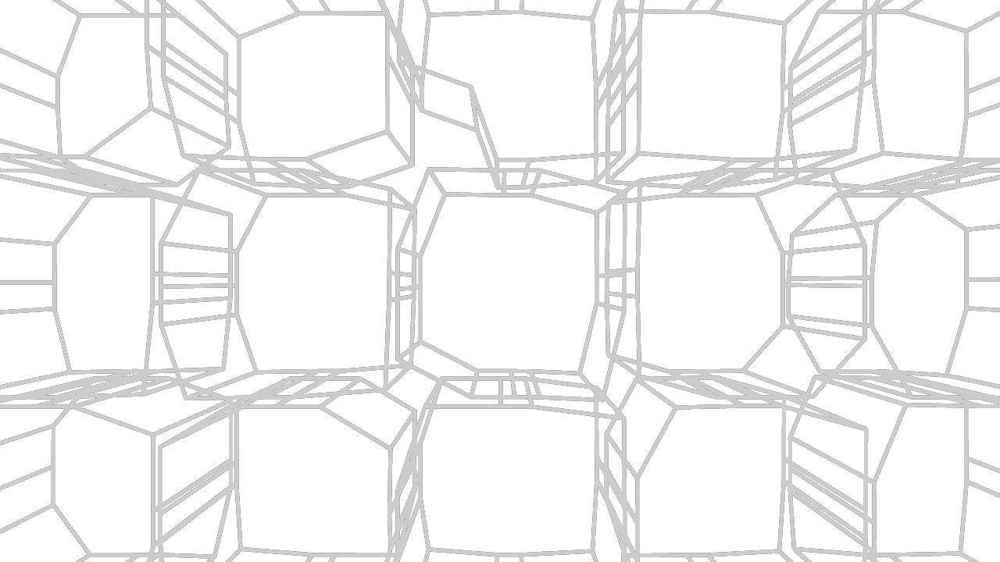

# **My favorite / intriguing outputs:**

## Noise Circles

**Environment:** p5.js
**Created during:** Week 5 
**Sketch Link:** https://editor.p5js.org/Bobbybear007/sketches/b81yWf7Ve

### Description

Noise Circles is one of my favourite p5.js experiments because it uses noise to make a simple circular form feel more organic and random. Instead of drawing perfect circles, the sketch uses p5.js noise values to distort the shape, making each circle appear random, and uneven.

The code works by drawing circular shapes and changing their points using noise. Noise is smooth, so the circles still feel natural rather than completely chaotic. This creates an animated effect where the shapes look like they are shifting in organic way.

I chose this piece because I liked how a basic idea, drawing circles, could become much more interesting by adding procedural variation. It helped me understand how noise can be used more for this type of randomness as compared to my previous understanding of it as Minecraft terrain generation.

## Purple Wormhole

**Environment:** p5.js
**Created During:** Week 6
**Sketch Link:** https://editor.p5js.org/Bobbybear007/sketches/-RTgTL2eN

### Description

Purple Wormhole is a p5.js script that creates an tunnel using an outlined rectangle that rotate and leaves a trail. I liked this piece because it gives the illusion of depth, almost like looking into a glowing portal or wormhole, and also how it changes over time, going from dense to more spacious. 

The code works by using repeatedly drawing a new rectangle around the center of the canvas with a slightly different rotation each frame. As the sketch runs, the repeated forms build up into a spiral pattern. I picked purple because it's my favorite colour and is the most "Trippy"

I chose this work because it shows how simple p5.js techniques, such as `translate()`, `rotate()`, repeated drawing, and colour, can create a much more complex visual effect. I also pick it because its one of my favorite outcomes from the "Just messing around" method of seeing "What if I do this".

## Rotating Noise Lines

**Environment:** p5.js
**Created During:** Week 6
**Sketch Link:** https://editor.p5js.org/Bobbybear007/sketches/wi-QWNKmJ

### Description

Rotating Noise Lines is a p5.js script that uses repeated lines, rotation, and noise to create a moving abstract pattern. I liked this piece because it looks cool and and reminds me of those clocks that are random lines until the show a number and I think this is how they do the randomness.

The code works by drawing lines that are affected by noise values. Instead of every line being placed or shaped in a completely predictable way, the noise changes the movement and position over time with the noise. This makes the final sketch feel more random, because the lines are reacting to the value from the noise.

________________________________________________________________________________________________________________________________________________________________________________________________________________________________________________________________________________________________________________________________________________________________________________________

## AudioNoiseSphere

**Environment:** Touch Designer
**Created During:** Week 10

### Description

AudioNoiseSphere is a Touch Designer output that uses an audio file to control the shape, colour, and opacity of a 3D sphere. I liked this piece because it's another outcome from the "Messing around process". 

The network works by starting with a `sphere1` SOP, which is then distorted using a `twist1` SOP. An `audiofilein1` CHOP brings in the sound, and `audiodyn1` processes the audio level so it can be used to drive the visual movement. This audio data is then connected into the 3D setup, affecting the shape and creating the pulsing, jagged movement in the sphere. A `line1` SOP is also used with the sphere geometry, helping create the wireframe-style line effect. The final 3D result is viewed through `cam1`, lit with `light1`, rendered with `render1`, then adjusted through `transform1` and composited over `bg`.

I chose this output because it's one I am very happy with, because I was just messing around, and is the output that got me past the point of having to google things in touch designer, and understanding how the program works so I can make something cool. It also pissed me off because the one thing I didn't work out was how to make the audio output not so drastic. I was aiming for a more subtle effect. But this is cool too.

## BoxLines

**Environment:** Touch Designer
**Created During:** Week 7

### Description

BoxLines is a Touch Designer output that turns a flat image into a 3D wireframe structure. I liked this piece because it's the first output I made in touch designer that outputs a 3d effect. But mainly the fact it starts with a 2d image, and converts that to 3d, I think that's really cool.

The network works by starting with `moviefilein1`, which contains the original black and white box/grid image. This is passed through `null1`, then into `trace1`, which converts the 2D image into line-based geometry. The traced shape is then sent into `extrude1`, giving the flat lines depth and turning them into a 3D form. After that, `null2` passes the geometry into `geo1`, where it is viewed through `cam1` and lit with `light1`. A `line1` material is also used to help create the thin wireframe line style. The final image is rendered through `render1` and sent to `moviefileout1`.

I chose this work because it helped me understand how Touch Designer can convert 2D visuals into 3D geometry. And it's also the first Touch Designer graph I made without building of docs, tutorials, or workshop content. It's the first output I %100 made me.

## TrippyGlitch

**Environment:** Touch Designer
**Created During:** Week 9

### Description

TrippyGlitch is a Touch Designer output that creates a bright, "trippy", glitch texture. I liked this piece because it takes basic perlin noise from being simple black and white, to being layered, visually complex, and oddly mesmerizing.  

The network works by using noise as the main source for the visuals. `noise4` feeds into `noise5`, which creates the colourful base texture, and this is then distorted through `displace2` to create the stretched glitch movement. A second branch starts from `noise6`, which is turned into sharper shapes using `edge2`, then softened with `blur3` and passed through `null3`. This branch also uses `feedback2`, `blur4`, and `level2` to create the trailing and glowing effect. The different visual layers are combined with `comp3`, passed through `null4`, then composited again with `comp4` before being sent to `moviefileout1`.

I chose this output because node for node it's the same thing we did in class. but looks completely different from the output made in class. I like that it shows that with touch designer, even if you copy someone else it will be different. Once I got the intended result. I started messing around, adding more layers, changing the type of noise, and ended up with this unique result.

